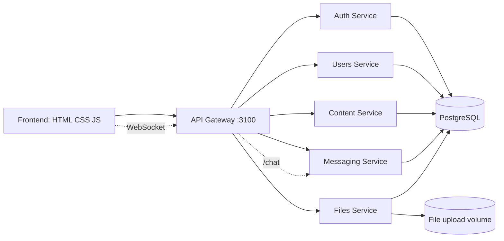
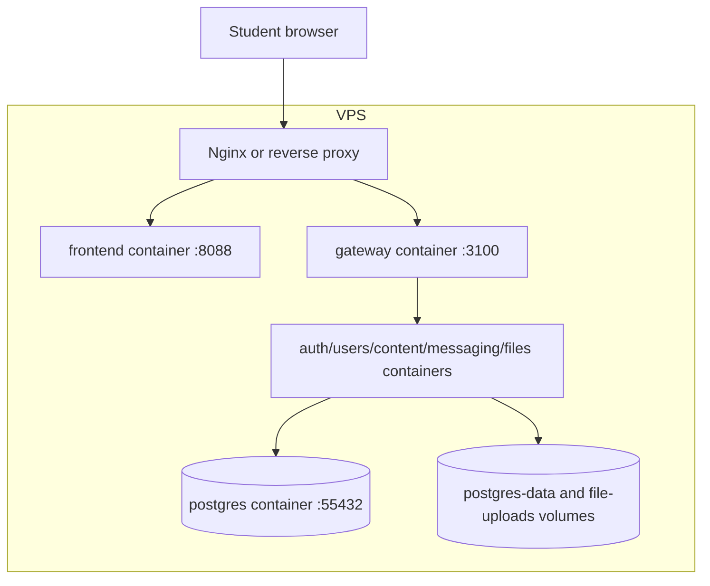

# StudNet Architecture Report

StudNet is a campus social network for ICT University students. The app is split into a static frontend and a five-service backend behind an API gateway.

## Service Diagram

## Backend Responsibilities

- Auth Service: registration, login, JWT creation, current user, logout.
- Users Service: profile, online users, friends/following, avatar and profile updates.
- Content Service: posts, likes, comments, events, notifications, global search.
- Messaging Service: one-to-one and group conversations, messages, WebSocket delivery.
- Files Service: file upload and public file serving.
- API Gateway: one public backend entry point, JWT validation, request routing, WebSocket proxy.

## Data Storage

PostgreSQL runs as a Docker container with a named volume. This is acceptable for the project and for a VPS deployment as long as the volume is backed up. The initial schema is loaded from `backend/database/schema.sql`.

## Deployment View

## Current Scope

The app currently supports registration/login, feed posts, likes, comments, search actions, events, notifications, profile editing, friends/following, group conversations, and message sending with files/images through the file service.
